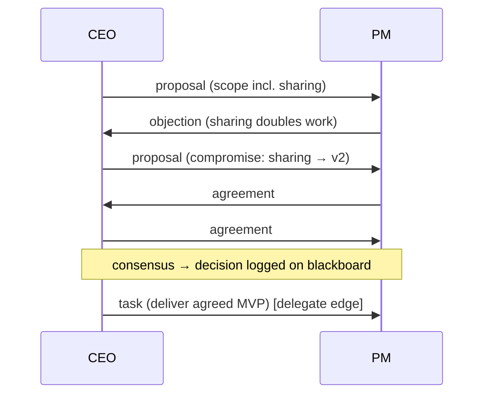
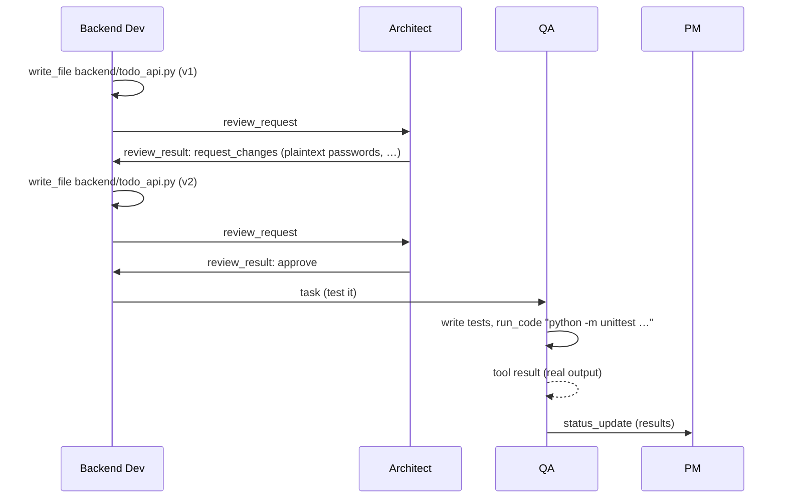
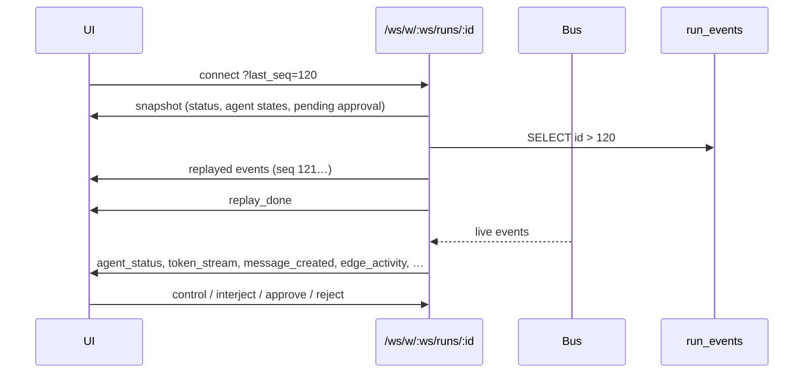

# Octopus architecture

## 1. Storage model

| Store | Location | Contents |
|---|---|---|
| Registry | `$OCTOPUS_HOME/registry.db` (default `~/.octopus`) | users, Fernet-encrypted provider keys (+ Azure options), MCP servers (encrypted env/headers), list of workspaces |
| Project | `<project>/.octopus/octopus.db` | companies, agents, edges, chat sessions, runs, messages, run events, tasks, artifact versions, agent memory |
| Project files | `<project>/…` | what agents read and write (sandboxed) |
| Working docs | `<project>/.octopus/work/` | agents' working material (specs, plans, briefs, reviews, QA notes); the only part of `.octopus/` agents can read or write |
| Plans | `<project>/.octopus/plans/<run_id>/` | shadow files written in `plan` permission mode |

Both databases are migrated with Alembic (`backend/migrations/{registry,project}`). The project DB is migrated when the folder is first opened. Opening a folder that already has `.octopus/project.json` re-attaches all of its history. When a project opens, any run that was `queued`/`running` in the previous process is marked `paused`, so it can be resumed.

## 2. Orchestrator

One `RunRuntime` (asyncio task) per run, in `backend/app/orchestrator/engine.py`.

```mermaid
flowchart TD
  A[bootstrap: goal → entry agents' mailboxes] --> L{limits ok?<br/>turns · tokens · cost · active time}
  L -- no --> F[finalize: failed + report]
  L -- yes --> G[gate: pause / step credits / awaiting user]
  G --> N{next runnable agent<br/>FIFO over mailbox + activating observations}
  N -- none --> Q[finalize: completed (quiescent)]
  N -- agent --> P[build prompt:<br/>system prompt + meta rules + roster + channels<br/>+ blackboard + rolling summary + recent + inbox + tool results]
  P --> S[stream LLM → token_stream + live activity detection]
  S --> X[parse JSON envelope → validated actions<br/>one repair retry]
  X --> E[execute actions<br/>permissions · protocols · approvals]
  E --> R[route messages → mailboxes<br/>persist + publish events]
  R --> D{entry agent finished?}
  D -- yes --> C[finalize: completed + report]
  D -- no --> L
```

**Action schema** (`orchestrator/actions.py`). Every reply is `{"thought": "...", "actions": [...]}` with actions `send_message`, `write_file`, `read_file`, `list_files`, `run_code`, `mcp_call`, `update_task_board`, `remember`, `request_user_input`, `web_search`, `calculate`, `finish` and `wait`. The schema text injected into the prompt lists only the actions the agent's tools allow. JSON-in-text works the same for every provider (Azure, Foundry, Ollama, …).

**Routing** (`orchestrator/permissions.py`). `find_channel(edges, src, dst, type)` picks the edge a message travels on, preferring the edge type that matches the message type (`proposal`→debate, `review_*`→review, `task`→delegate, `status_update`→report…). It respects direction; debate edges only carry debate-protocol types. If no channel exists, the message is **rejected server-side**: it is never delivered, and the sender gets an activating notice explaining why (`no channel`, `one-way`, `wrong type`).

**Limits.** Global max turns, per-edge `max_turns`, token budget, cost budget, active wall-clock timeout (paused time is excluded), per-agent `max_autonomous_turns`, and a loop detector. The detector rejects near-duplicate messages on the same pair; after N strikes the run auto-pauses for human review. The kill switch cancels the task immediately; a report is still produced.

**Context management.** Each turn contains the agent's last N messages verbatim. Older ones are compressed into an extractive rolling summary (first sentence per message, newest first within a character budget), plus the blackboard: goal, decisions, debate/review states, task board, file index, and user notes.

**Live activity.** While a reply streams, `live_activity()` scans the partial JSON for the action being composed. It emits `agent_status` updates such as *"Drafting proposal to Priya…"* or *"Writing backend/todo_api.py…"* before the action executes. During execution, statuses become `writing`, `reading`, `running`, `tool` and `awaiting_approval`.

## 3. Teams, departments and templates

**Org model.** Every agent has `department`, `is_manager`, `reports_to`, `active` and `created_by`. Templates
(`services/templates.py`) are declared as departments (one manager plus members). `wire_org()` derives the channels:
manager → member `delegate`, member → manager `report`, head ↔ department managers, peer managers `consult`,
plus explicit cross-department links (reviews, debates, consults). User templates are stored in the global registry
(`user_templates`) as company exports, so they're reusable in every project. `org_generator.py` designs an org from a
prompt with the configured model (strict JSON spec), or with a deterministic keyword-based designer in Demo Mode.

**Runtime team management** (`orchestrator/team.py`, mixed into `RunRuntime`):

| Action | Who | Rules |
|---|---|---|
| `list_agents` | everyone | the roster with department, manager, live status (or *inactive*), activity, turns, hired-by, and your channels |
| `update_agent` target `self` | everyone | role, prompt (`append_to_prompt`), description, temperature, behavior; tools can only be dropped; the turn cap can't be raised; the permission level can only go down |
| `create_agent` | `manage_team` tool | hire into a department and report to yourself or someone you manage; tools ⊆ the hirer's tools; auto delegate/report channels plus `connect` to agents you can already reach; optional `brief` becomes the first task; capped by `budget.max_agents` |
| `update_agent` other | `manage_team` + you manage or hired the target | same as self, plus `is_manager`, `active` (deactivate), and granting tools you have |

Inactive agents never take turns, and messages to them are rejected. Permission levels: `read_only` can't hire;
`read_only` and `plan` changes live only for the run; `ask` requests approval before a change is saved; `danger` saves
directly. Saved changes are written to the company and bump `Company.revision`. The canvas autosaves with
`revision`, so a stale editor gets **409** and reloads instead of overwriting hires. Events `agent_created` and
`agent_updated` animate the live graph and appear in the feed and the run report ("Org changes").

## 4. Protocols (`orchestrator/protocols.py`)

### Debate
- A debate opens with a `proposal`. Each side replies with `objection` (reasons), a compromise `proposal`, or `agreement`.
- **Consensus is explicit:** *both* participants must send `agreement` after the latest proposal or objection. Any new proposal or objection resets it.
- It ends on consensus, on a `decision` (e.g. from a moderator over consult edges), or at `max_rounds` (closed; both sides are told to escalate).



### Review
The author sends `review_request`; the reviewer replies with `review_result`, `verdict` = `approve` or `request_changes`, and itemized `comments`. Each `request_changes` increments the revision count; at `max_revisions` the loop closes with outstanding comments recorded.



### Delegation / task board
A `task` message is linked to a task-board entry (by `task_id`, or an open task assigned to the recipient), or a new task is created automatically. Managers use `update_task_board` to create or update tasks (assignee, acceptance criteria, status `todo → in_progress → in_review → done | blocked`).

## 5. Permissions and approvals

The effective level is `min(run level, agent override)`, ordered `read_only < plan < ask < danger`.

| Action | read_only | plan | ask | danger |
|---|---|---|---|---|
| read / list files | ✅ | ✅ (shadow first) | ✅ | ✅ (+ secrets) |
| write_file | ❌ | ✅ → `.octopus/plans/<run>` | 🟡 approval (diff) | ✅ |
| run_code | ❌ | ❌ | 🟡 approval, allowlist | ✅ any single command, network |
| mcp_call | ❌ | ❌ | 🟡 approval | ✅ |

An approval blocks the agent's turn on a future. The run is `awaiting_user`, and the UI shows an approval card with a diff, command or arguments. *Always allow* auto-approves that action kind for that agent for the rest of the run. Supervised mode also asks before `finish`.

## 6. Events and realtime

Every event except `token_stream` is appended to `run_events` with a monotonic id (`seq`). WebSocket clients connect with `?last_seq=N`. The server sends a snapshot, then **replays** every persisted event after N, then streams live events, de-duplicated by `seq`. The frontend reducer (`features/runs/runState.ts`) is pure and powers both the live view and the timeline scrubber (`replayTo(events, cursor)`).



Event types: `snapshot`, `run_status`, `agent_created`, `agent_updated`, `agent_status` (+activity), `turn_started`, `token_stream`, `thought`, `message_created`, `message_rejected`, `edge_activity`, `tool_call`, `tool_result`, `task_updated`, `artifact_updated`, `usage_update`, `protocol`, `approval_requested`, `approval_resolved`, `agent_finished`, `error`.

## 7. LLM layer (`backend/app/llm`)

- **One real provider.** `router.PROVIDER_CATALOG` holds Azure OpenAI (`gpt-6-luna` by default) plus the offline `mock`. `prepare_request` routes every non-mock agent to Azure and maps unknown models to the configured deployment. It moves credentials saved on the legacy *Foundry* card to Azure, and in Demo Mode falls back to the mock when Azure isn't configured.
- **`azure_v1.AzureV1Provider`** streams from `/openai/v1/responses` (default) or `/openai/v1/chat/completions`. `azure_v1_target()` accepts any endpoint shape and needs no `api-version`.
  - The deployment is sent as `model`, with `reasoning.effort` (Responses) or `reasoning_effort` (Chat).
  - `max_output_tokens` gets reasoning headroom.
  - `phase: "commentary"` text is skipped.
  - A parameter the deployment rejects (for example `temperature`) is dropped, retried and remembered per deployment.
  - Legacy `/openai/deployments/...` URLs go through `LiteLLMProvider`.
- **Usage and pricing (`pricing.py`).** `Usage` carries the exact provider counts: input (incl. cached and cache-write) and output (incl. reasoning). `pricing.apply()` prices each part at per-deployment rates:
  - Defaults for gpt-6-luna Standard, per 1M tokens: $0.10 input, $0.01 cached, $0.125 cache write, $0.50 output.
  - Prompts over 272K tokens: 2× input and 1.5× output.
  - Data Zone and regional deployments: +10%.
  - User overrides come from Settings.

  The runtime aggregates totals, per-agent tokens and cost, and a cost breakdown, and emits them in `usage_update`. Costs are stored in USD. `services/fx.py` supplies USD→display-currency rates (ECB via Frankfurter, with ExchangeRate-API as a fallback), cached for 6h, with the last known rate used offline.
- **Retries.** `stream_with_retry` retries 429/5xx/network errors with exponential backoff and jitter, but only if nothing has streamed yet.
- **Demo Mode.** `MockProvider` plus `demo_script.py` implement deterministic, role-aware scripted policies that react to the actual inbox and topology, so edited companies still terminate. QA really runs the generated tests in the sandbox. `followup()` handles continued runs: the entry agent hands the change to a teammate, who records it in `docs/CHANGES.md` and reports back. Usage is estimated and priced at gpt-6-luna rates.

## 7b. Runs continue like chats

`RunManager.continue_run()` is used by `POST /runs/{id}/continue`, by `/interject`, and by the run WebSocket's `interject` message.
- **Live run:** the message is injected into the running team.
- **Finished run (`completed`/`failed`/`cancelled`):** the **same run** is re-opened in these steps:
  1. The `RunRuntime` is rebuilt with `restore()`: the full message history, task board, artifacts, observations, protocol state and mock state.
  2. The stale mailbox is cleared.
  3. `continue_with()` runs:
     - it records the follow-up;
     - it resets the per-agent autonomy counters;
     - it gives the budgets fresh headroom on top of what was already used;
     - it sets `status=running` and emits `run_continued`;
     - it delivers `"Follow-up from the user: …"` to the entry agent(s), or to the agent you chose.
  4. The blackboard lists the follow-ups and tells agents to build on the existing work.

The files are never touched, artifact versions keep counting on the same run, and the chat stays one continuous feed. **New run** is a separate, explicit action.

## 7c. Agent tools added on top of the core schema

- **Folders.** `create_folder` and `move_file` (move or rename files or whole folders, with `ProjectFS.make_dir` / `ProjectFS.move`) are gated like `write_file`. They respect the sandbox (no traversal, no `.git`/`.octopus`, no secrets outside danger mode, no moving a folder into itself). In plan mode, folders go to the plan shadow and moves are refused. The run's artifact paths follow moves.
- **Questions.** `request_user_input` takes `question` plus `options: [{label, description, recommended}]` (2-5; exactly one ends up recommended). The UI (`QuestionCard`) shows them as choices with a **Recommended** tag plus *Something else* for a typed answer. The answer is delivered to the asking agent.
- **Browser (`services/browser.py`).** Octopus supervises one `@playwright/mcp` process on `127.0.0.1` (random port, `--allowed-hosts`, `--isolated`, `--shared-browser-context`). It installs the browser on first use and stops it on shutdown.
  - Each (run, agent) pair gets a **long-lived MCP session**, i.e. a persistent tab, in a dedicated task. The regular MCP client opens a session per call, which would lose the page.
  - Agents with the `browser` tool (on by default) see it as MCP server `browser` and are told the preview URL.
  - Sessions close when the run finalizes.
- **Reasoning effort.** `behavior.reasoning_effort` per agent, overridable run-wide with `budget.reasoning_effort` (`default|none|low|medium|high|xhigh|max`). The channel-condition gatekeeper always uses `low`.

## 7d. Projects, folders and preview

- **Native folder dialog (`services/native_dialog.py`).** It uses `osascript` on macOS, PowerShell `FolderBrowserDialog` on Windows, and zenity/kdialog/yad on Linux, with a Tk fallback. It runs only for requests from the same machine. `POST /workspaces/native` opens the dialog and registers the folder server-side; the allowed-roots check doesn't apply because the user picked the folder on their own desktop. Without a desktop (Docker/SSH) the UI falls back to the in-app browser.
- **Self-managed `.octopus/`.** `ensure_layout()` creates or repairs `work/`, `plans/`, `exports/`, `browser/`, `README.md` and `.gitignore` (`*`) every time a project is opened.
- **Preview (`services/preview.py`).** It serves project files (plan shadow first for run previews) with real MIME types under a CSP sandbox. That CSP explicitly allows the preview base URL, because `'self'` matches nothing in an opaque-origin sandbox. It also allows `https:` CDNs and forbids forms and framing by other origins. `/api/v1/w/{id}/preview/…` serves the live folder, and `/runs/{id}/preview/…` serves a run's view.

## 8. Frontend

- The typed client (`openapi-fetch`) is generated from FastAPI's OpenAPI schema (`npm run gen:api`).
- Canvas state lives in a Zustand store with history (undo/redo), clipboard and connection rules. Autosave is a debounced full-graph `PUT /canvas`; the server upserts and deletes by id, so client-generated UUIDs stay stable.
- Nodes read a `LiveContext` overlay, so the same components render the editable canvas and the animated read-only run graph.
- Monaco and the fonts are bundled locally. No CDNs are used, so it works offline.
