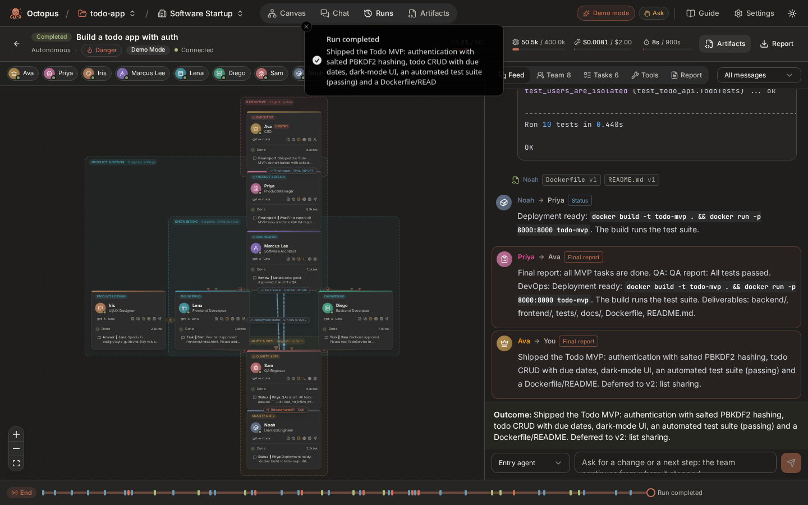
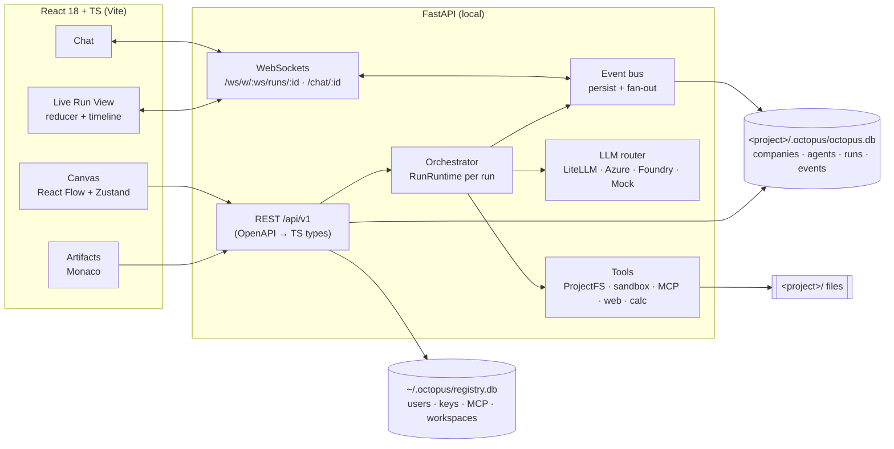
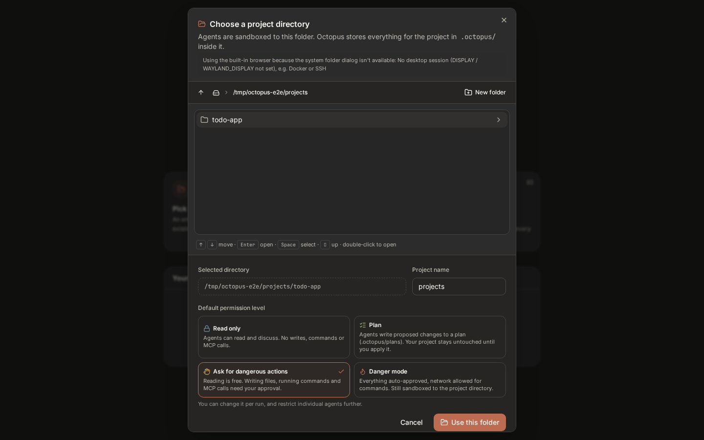
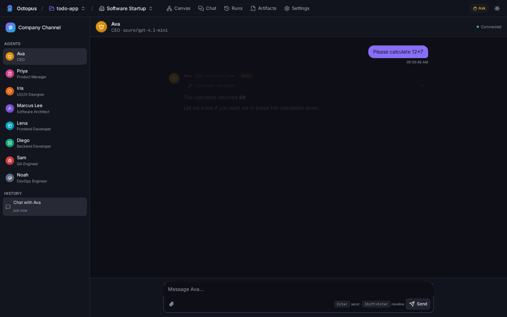

# 🐙 Octopus: a virtual software company of AI agents

Octopus lets you assemble a **company of AI agents** (CEO, PM, Architect, Developers, QA, Designer, DevOps…), wire them together on an **n8n-style canvas**, and give the company a goal such as *"Build a todo app with auth"*. The agents debate, delegate, review each other's work and **write real files into your project folder**. You can watch everything live, step through it, interject, approve or reject dangerous actions, and replay the run afterwards.

- **Runs 100% locally.** Your project directory is the agents' sandbox. All project data lives in `<project>/.octopus/`.
- **Models:** Azure OpenAI and Azure AI Foundry are first-class (API key or Microsoft Entra ID). OpenAI, Anthropic, Gemini and Ollama also work through LiteLLM.
- **Demo Mode** runs a deterministic, scripted, offline company, so it needs no keys and costs nothing.



## Features

| Area | What you get |
|---|---|
| **Projects** | Pick any folder (server-side folder picker). Octopus creates `.octopus/` with its own SQLite DB, plans and exports. Re-opening a folder restores everything. |
| **Agent Canvas** | React Flow graph. Agent nodes show avatar, role, model, tools, permission and **live status** (thinking / drafting a message / writing a file / running a command / using a tool / needs approval…). Drag roles from a palette, use the right-click menu, copy/paste, undo/redo, auto-layout, snap-to-grid, minimap, and JSON import/export. Changes autosave with visible save state. |
| **Quick config** | Click a node to open a mini window next to it: name, role, system prompt (with `{{variables}}`), tools (read, write, list, terminal, web, calculator, ask-user, messaging), **MCP servers**, permission level, model, and the entry flag. The full inspector has 7 tabs (Profile, Prompt, Model, Tools, Behavior, Memory, Activity). |
| **Departments & templates** | Companies are built from **departments**, each with one manager and 1-2 members. Seven built-in templates (Software Startup, Full Company with 6 departments, Self-organizing, Research Lab, Small Dev Team, Debate Panel, Blank). Design your own: use **Add department** on the canvas (auto-wired channels), then **Save as template**, or import/export JSON. **Generate with AI** turns a prompt into a full org (departments, prompts, tools, channels) you can review before creating. Department zones and an Org panel with active/inactive toggles show the structure. |
| **Agents manage the team** | At runtime agents can `list_agents` (sees active, idle, done and inactive teammates), `create_agent` (hire into a department, with a brief and channels), and `update_agent` (edit their own config or that of agents they manage; deactivate reports). There is **no privilege escalation**: hires get at most the hirer's tools, nobody can grant themselves tools or raise limits, and permission levels apply (`ask` means approval before saving). Hires animate onto the live graph and are saved to the company. |
| **Channels** | Edges are typed (`delegate`, `review`, `debate`, `report`, `consult`) and can be one-way or bidirectional. Each has a label, max turns, max rounds/revisions, handoff instructions, and an optional natural-language **condition** checked by a gatekeeper model. |
| **Orchestrator** | Per-agent mailboxes and an event bus with replay. **The server enforces that agents only talk over edges.** Includes a debate protocol (explicit two-sided agreement or a moderator decision), a review loop, a task board, a loop detector, and budgets (turns, tokens, cost, time). Run modes: autonomous, step and supervised. |
| **Permission levels** | `read_only`, `plan` (writes go to `.octopus/plans/<run>`; apply later), `ask` (approval card with diff; *always allow* per agent/action) and `danger` (auto-approve, network allowed, still sandboxed to the folder). Per-agent overrides can only be *more* restrictive. |
| **Chat** | Direct chat with any agent: streaming, markdown, code copy, tool calls, stop/regenerate, attachments (txt/md/pdf/code), and long-term memory. In the Company Channel you send a goal; the internal agent-to-agent feed can be filtered to *All*, *User-facing only* or *Internal only*. |
| **Live Run View** | An animated graph (particles travel along edges; nodes glow with their activity), a live token stream, usage meters, tasks, a tool log, approvals, interjection, and a **timeline scrubber** for replay. |
| **Artifacts** | File tree, Monaco viewer and side-by-side diff for every version, per-version author and reason, revert, apply plan, ZIP download, and a sandboxed HTML live preview. |
| **Run Report** | Auto-generated Markdown covering goal, team, key decisions, debates, reviews, final task board, artifacts, test results, guardrail events, timeline, and token/cost summary. |

## Quick start (local)

Requirements: Python 3.11+, Node 20+.

```bash
cp .env.example .env        # optional: Azure endpoint/key, allowed project roots
make setup                  # backend venv + frontend deps
make dev                    # API :8000 (docs at /docs) + UI :5173
# or a single process that serves the built UI:
make start                  # http://localhost:8000
```

1. Click **Open project folder**, pick (or create) a directory, and choose a default permission level.
2. **Create company** → *Software Startup*.
3. Press **Run**, enter a goal, keep **Demo Mode** on, and watch.

New to Octopus? Open **Guide** in the top bar (or `/guide`) for an illustrated tour of every feature.

### Azure OpenAI / Azure AI Foundry

Go to **Settings → Model providers**:

- **Azure OpenAI**: paste the endpoint exactly as the portal shows it (for example `https://<resource>.services.ai.azure.com/openai/v1/responses`, `…/openai/v1/chat/completions` or just `https://<resource>.openai.azure.com`), an API key or **Entra ID** (`az login`; the identity needs the *Cognitive Services OpenAI User* role), and your **deployment names** (e.g. `gpt-6-luna`). Octopus calls the Azure **v1 API** directly (Responses API by default, Chat Completions if the URL ends in `/chat/completions`), with no `api-version`. Parameters a deployment rejects, like `temperature` on reasoning models, are dropped automatically. Legacy `…/openai/deployments/<name>/…` URLs still use the dated `api-version` path.
- **Azure AI Foundry models**: endpoint `https://<resource>.services.ai.azure.com/models`, plus model names such as `DeepSeek-R1` or `Phi-4`.

Use **Test connection** to check each one. Env vars (`AZURE_API_BASE`, `AZURE_API_KEY`, `AZURE_AI_API_BASE`, …) work too. Keys are Fernet-encrypted at rest and never returned to the browser.

### MCP servers

**Settings → MCP servers** registers stdio (e.g. `npx -y @modelcontextprotocol/server-everything`) or streamable-HTTP servers. Octopus connects, lists their tools, and lets you grant servers per agent from the node's quick config. Agents call them with `mcp_call`. The permission level applies (`ask` requires approval; `read_only` and `plan` block calls).

### Docker (optional, still local)

```bash
OCTOPUS_PROJECTS=~/code docker compose up --build   # UI http://localhost:8080
```

## Architecture



Details (orchestrator loop, protocols, sequence diagrams, security model) are in **[ARCHITECTURE.md](ARCHITECTURE.md)**. The presentation script is in **[DEMO.md](DEMO.md)**.

```
octopus/
├─ backend/app/{api,core,db,models,schemas,services,orchestrator,llm,tools,prompts}
│  ├─ migrations/{registry,project}   Alembic (applied automatically)
│  └─ tests/                          67 tests: routing, protocols, limits, security, MCP, teams, full demo runs
└─ frontend/src/{components,features/{canvas,chat,runs,artifacts,settings,workspaces},hooks,stores,lib,types}
   └─ e2e/                            Playwright: happy path, approvals, org generation/templates, live hiring
```

## Testing

```bash
make test-backend     # pytest: edge-permission routing, loop detection, debate termination, review loops,
                      #         budgets, pause/step/stop, permission levels, path traversal, MCP, e2e demo run
make test-frontend    # tsc strict + vitest (reducer, canvas store, components)
make e2e              # Playwright: folder → template → edit agent → chat → run → artifacts; ask-mode approval
```

## Screenshots

| | |
|---|---|
|  |  |
|  |  |
|  |  |
|  |  |
|  |  |
|  |  |

## Security notes

- Agents only see the project folder. The sandbox rejects absolute paths, `..`, and symlinks resolving outside the folder (checked on real paths). `.octopus/` and `.git/` are never accessible, and secrets (`.env`, keys) are blocked unless in danger mode.
- Commands run without a shell and with a scrubbed environment. They are limited by rlimits (CPU, memory, file size, processes) and a timeout, and have no network (`unshare -n`) where the OS allows it. An allowlist applies outside danger mode, or you can use `SANDBOX_MODE=docker` for container isolation.
- stdio MCP servers run commands **you** configure on your machine (`MCP_ALLOW_STDIO=false` disables them).
- The API has rate limiting, strict CORS and Pydantic validation, and binds to `127.0.0.1` by default. Single-user mode is on by default; set `SINGLE_USER_MODE=false` for JWT login.
