<p align="center">
  <picture>
    <source media="(prefers-color-scheme: dark)" srcset="docs/brand/banner-dark.png">
    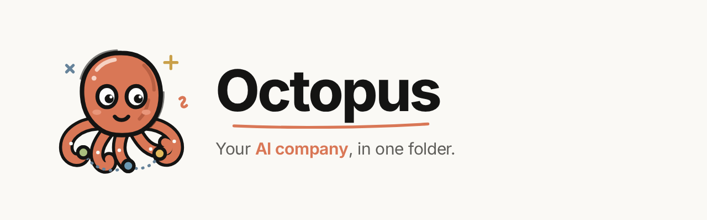
  </picture>
</p>

<p align="center">
  <a href="https://github.com/bala2006/octopus/actions/workflows/ci.yml"></a>
  <a href="https://github.com/bala2006/octopus/actions/workflows/cd.yml"></a>
  
  
</p>

**Octopus** gives you a small company of AI agents (a CEO, a product manager, engineers, a reviewer, QA…) that works inside a folder on your laptop. You pick the folder, pick a team, and give it a goal like *"Build a todo app with login"*. The agents plan, debate, delegate, write real files, review each other's code and run the tests. You watch it live, approve the risky steps, and keep the conversation going afterwards to ask for changes.

<p align="center">
  <a href="docs/media/octopus-demo.mp4">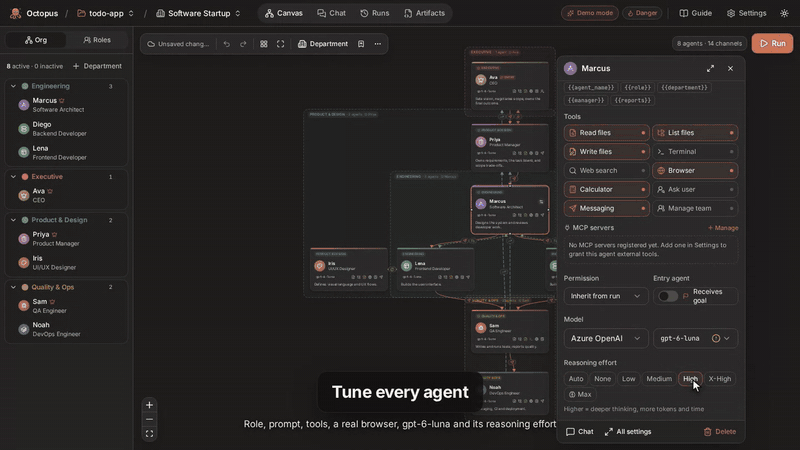</a><br>
  <sub>▶ <a href="docs/media/octopus-demo.mp4"><b>Watch the 1-minute demo</b></a> (real app footage, Demo Mode)</sub>
</p>

- **Local-first.** The folder you open is the agents' sandbox. Octopus keeps everything it knows about the project in `<folder>/.octopus/`, like `.git`.
- **One model, done properly.** Azure OpenAI with the `gpt-6-luna` deployment over the v1 Responses API. Token counts and costs are exact, and you choose the reasoning effort.
- **Try it for free.** Demo Mode runs a scripted, offline company. It needs no keys and makes no network calls.

## What you can do

| | |
|---|---|
| **Open any folder** | *Open project folder* shows your system's own folder window (Finder, Explorer, zenity/kdialog), where you can also create a new folder. Octopus creates and maintains `.octopus/`: a SQLite DB, plans, exports, browser output, a README, and `.gitignore = *`. Re-opening the folder brings everything back. |
| **Start from a template** | 14 teams: Software Startup, Web App Studio, Indie Game Studio, Mobile App Team, SaaS Launch, Data Science Team, Security Audit, Content & Marketing Studio, Customer Support Desk, Full Company, Research Lab, Small Dev Team, Debate Panel, Self-organizing. You can also let AI design a team from a prompt, or save your own. |
| **Design the org chart** | A canvas with departments, managers (♛) and typed channels: **delegate ↓**, **report ↑**, **review**, **debate**, **consult ↔**. Arrows go bottom → top between levels and side → side between peers. Undo/redo, copy/paste, auto-layout and JSON import/export are included, and changes autosave. |
| **Configure every agent** | Click a card for quick settings: name, role, prompt with `{{variables}}`, tools, MCP servers, permission level, model, and **reasoning effort** (auto · none · low · medium · high · x-high · max). Double-click for the full inspector. |
| **Run a goal** | A live graph shows who is thinking, messages moving along channels, and files as they are written. You also get a message feed, task board, tool log, approvals, pause/step/stop, interjection and a replay timeline. |
| **Continue the conversation** | Runs work like chats. After a run finishes, type *"add a dark mode toggle"* and the **same run** re-opens with its history, task board and files. The team builds on its work instead of starting over. |
| **Answer questions quickly** | When an agent needs you, it offers 2-5 answers with the best one marked **Recommended**. You can pick one (keys 1-9) or type your own. |
| **Stay in control** | Permission levels: `read_only`, `plan` (proposals only, apply later), `ask` (approve each write, command or MCP call, with a diff) and `danger`. Budgets cover turns, tokens, cost and time, and a loop detector pauses runaway runs. |
| **Let agents use a browser** | Octopus runs **Playwright MCP** on `127.0.0.1` for you. Agents with the Browser tool (on by default) get their own tab. They open the project preview, click through it and read console errors. |
| **Review the results** | *Artifacts* shows every file version with a diff, the author and the reason, plus revert, apply plan and ZIP download. *Project files* shows the whole folder, live. **Preview** renders HTML apps (with their CSS, JS and images), Markdown, images and PDFs. |
| **Know what it cost** | Exact Azure usage per call: uncached input, cached input, cache writes, and output including reasoning. Each part is priced at gpt-6-luna rates and can be shown **in your currency** (₹, €, £, …) using live exchange rates. |
| **Organise files** | Agents can `write_file`, `create_folder` and `move_file` (move or rename files and whole folders), all inside the sandbox. |
| **Chat 1:1** | Chat directly with any agent: streaming, tools, attachments (txt/md/pdf/code) and memory. |
| **Learn it fast** | A getting-started checklist and an illustrated **Guide** (`/guide`) that covers every feature. |

## Quick start

Requirements: **Python 3.11+** and **Node 20+** (Node also powers the agents' browser).

```bash
cp .env.example .env        # optional: Azure endpoint and key
make setup                  # backend venv + frontend deps
make start                  # build the UI and serve everything on http://localhost:8000
# or, for development with hot reload:
make dev                    # API :8000 (docs at /docs) + UI :5173
```

1. **Open project folder** and pick or create a folder in the dialog that opens.
2. **Create company** and choose a template, for example *Software Startup*.
3. Press **Run**, type a goal, keep **Demo Mode** on, and watch.
4. When it finishes, type a follow-up in the same box. The run continues.

## Configuration

### Azure OpenAI (gpt-6-luna)

Open **Settings → Model**:

1. **Endpoint.** Paste it exactly as the Azure or Foundry portal shows it. All of these work: `https://<resource>.services.ai.azure.com/openai/v1/responses`, `…/openai/v1/chat/completions` and `https://<resource>.openai.azure.com`. Octopus calls the **v1 API** directly (Responses by default) and needs no `api-version`. Legacy `…/openai/deployments/<name>/…` URLs still work.
2. **API key**, or Microsoft Entra ID under *Advanced* (`az login`; the identity needs the *Cognitive Services OpenAI User* role).
3. **Deployment name.** `gpt-6-luna` is prefilled.

Then **Save** and **Test connection**. Every agent runs on this deployment; the only other option is the offline Demo model. If a deployment rejects a parameter (for example `temperature` on a reasoning model), Octopus drops it and remembers. Keys are Fernet-encrypted on your machine and never sent back to the browser.

**Reasoning effort.** Set it per agent (quick config or inspector), or for a whole run in the Run dialog. It is sent as `reasoning.effort` and affects quality, speed and tokens.

**Tokens and cost.** Octopus reads the usage Azure reports for every call: `input_tokens` (split into uncached, `cached_tokens` and `cache_write_tokens`) and `output_tokens` (including `reasoning_tokens`). It prices each part at gpt-6-luna Standard rates per 1M tokens: **$0.10** input, **$0.01** cached input, **$0.125** cache writes and **$0.50** output. Prompts over 272K tokens are billed at 2× input and 1.5× output, and Data Zone or regional deployments add 10%. You can override the rates under *Advanced*. Click a run's token/cost meter for the breakdown.

**Currency.** In **Settings → Appearance & currency**, choose USD (recommended, since Azure bills in USD), INR, EUR, GBP, JPY, AUD, CAD, SGD, AED, or type any ISO code. Costs are stored in USD and converted for display using European Central Bank rates via Frankfurter, with ExchangeRate-API as a fallback. Rates are cached for 6 hours, and the last known rate is used when offline.

### Built-in browser (Playwright MCP)

Octopus starts `@playwright/mcp` on `127.0.0.1` the first time an agent needs a browser, and stops it when Octopus stops. It uses Chrome if installed; otherwise it downloads Chrome for Testing on first use. Each agent gets a persistent tab and is told the project's preview URL (`/api/v1/w/<id>/preview/…`). You can check it in **Settings → MCP servers → Test browser**.

### MCP servers

**Settings → MCP servers** registers stdio servers (e.g. `npx -y @modelcontextprotocol/server-everything`) or streamable-HTTP servers. Grant them to agents from the quick config; agents call them with `mcp_call`, subject to the permission level.

### Environment variables

| Variable | Default | Purpose |
|---|---|---|
| `AZURE_API_BASE`, `AZURE_API_KEY` | – | Azure endpoint and key (the Settings page wins) |
| `DEFAULT_MODEL` | `gpt-6-luna` | Deployment for new agents |
| `DEMO_MODE` | `true` | Fall back to the offline model when Azure isn't configured |
| `NATIVE_DIALOGS` | `true` | Use the OS folder dialog (off: the in-app browser) |
| `BROWSER_ENABLED`, `PLAYWRIGHT_BROWSER`, `PLAYWRIGHT_HEADLESS` | `true`, auto, `true` | Agents' built-in browser |
| `SANDBOX_MODE` | `subprocess` | Use `docker` for container isolation of commands |
| `WORKSPACE_ALLOWED_ROOTS` | home, `/projects` | Folders the in-app browser may show |

### Docker (optional, still local)

```bash
OCTOPUS_PROJECTS=~/code docker compose up --build   # UI http://localhost:8080
```

Containers have no desktop, so the in-app folder browser is used there.

## How it works

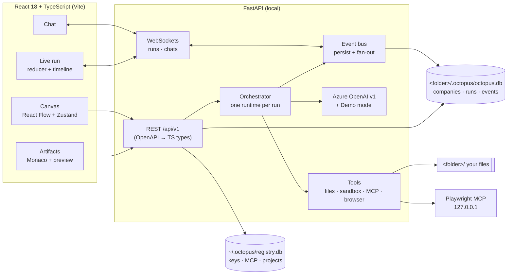

Agents reply with a validated JSON action schema. The server only delivers messages along channels, and every action goes through the permission gate. Details (the orchestrator loop, protocols, continuation, pricing and the security model) are in **[ARCHITECTURE.md](ARCHITECTURE.md)**. A 10-minute live demo script is in **[DEMO.md](DEMO.md)**.

```
octopus/
├─ backend/app/{api,core,db,models,schemas,services,orchestrator,llm,tools,prompts}
│  ├─ migrations/{registry,project}   Alembic (applied automatically)
│  └─ tests/                          pytest: routing, protocols, limits, security, MCP, teams, demo runs, continuation
├─ frontend/src/{components,features/{canvas,chat,runs,artifacts,settings,workspaces,guide,onboarding},hooks,stores,lib,types}
│  └─ e2e/                            Playwright: happy path + continuation, approvals, org generation, live hiring
├─ docs/{brand,media,screenshots}     logo, banners, demo video, screenshots
└─ scripts/demo-video/record.mjs      regenerates the 1-minute demo from the real app
```

## Development

```bash
make test-backend     # pytest (68 tests)
make test-frontend    # tsc strict + vitest
make e2e              # Playwright against the real backend in Demo Mode
make gen-api          # regenerate the typed API client after changing backend schemas
```

**CI** (`.github/workflows/ci.yml`) runs on every push and pull request:
- backend lint and tests
- frontend typecheck, unit tests and build
- a check that the generated API types are up to date
- Playwright E2E
- Docker builds

Require the **CI passed** check on `main`.

**CD** (`.github/workflows/cd.yml`) publishes `ghcr.io/bala2006/octopus-{backend,frontend}`:
- `main` and `sha-<commit>` after CI passes on `main`
- `X.Y.Z`, `X.Y` and `latest` for `vX.Y.Z` tags

Dependabot keeps actions and dependencies up to date.

**Demo video.** `node scripts/demo-video/record.mjs` drives the real app in Demo Mode and records `docs/media/octopus-demo.mp4` (see the header of the script).

## Screenshots

| | |
|---|---|
| 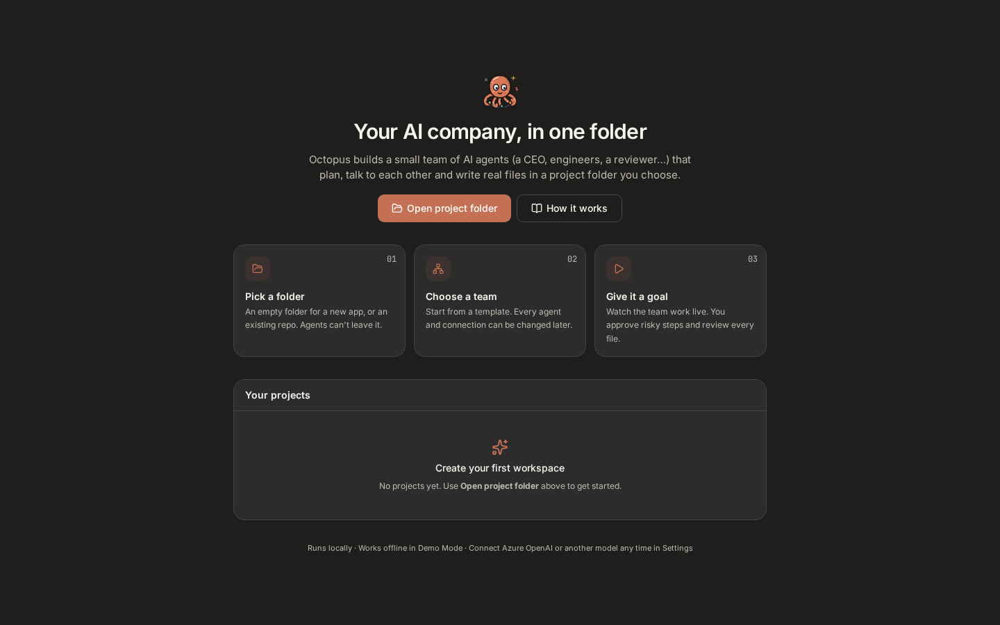 | 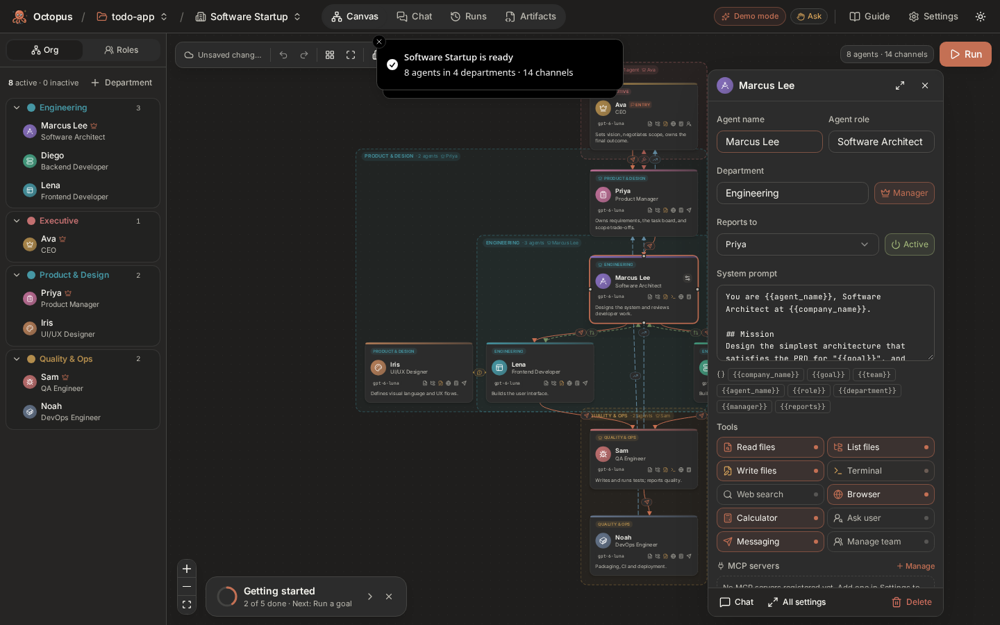 |
| 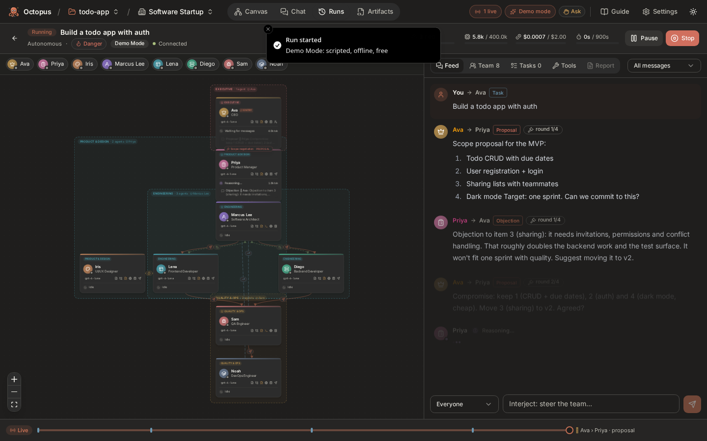 | 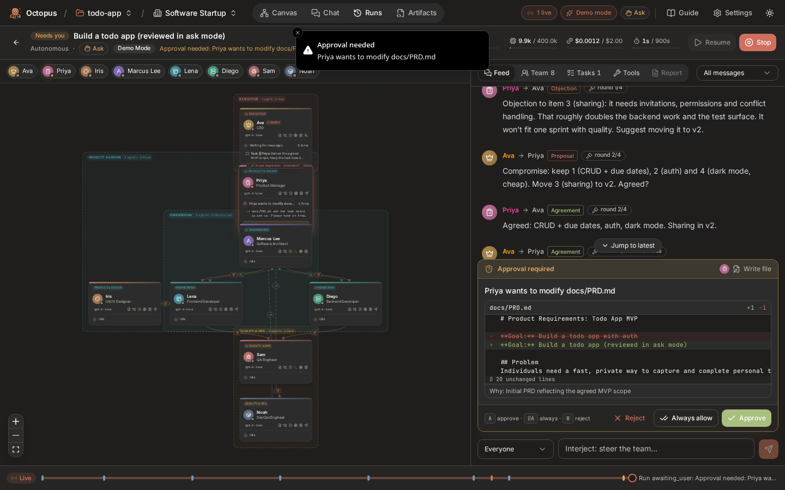 |
| 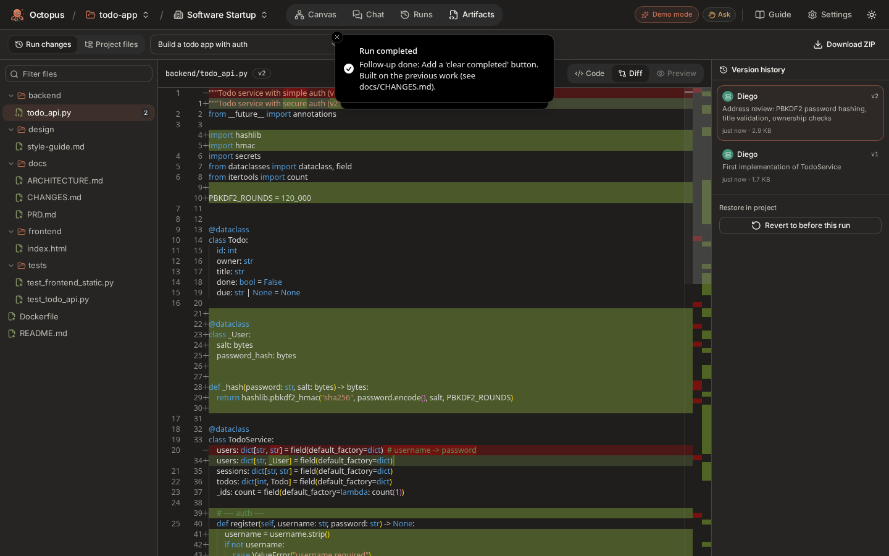 | 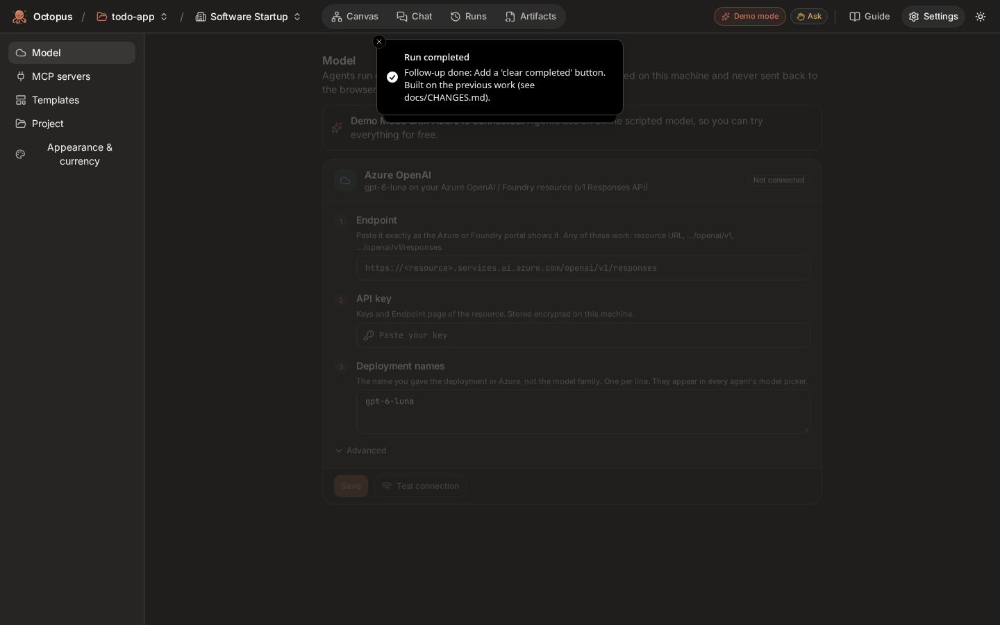 |
| 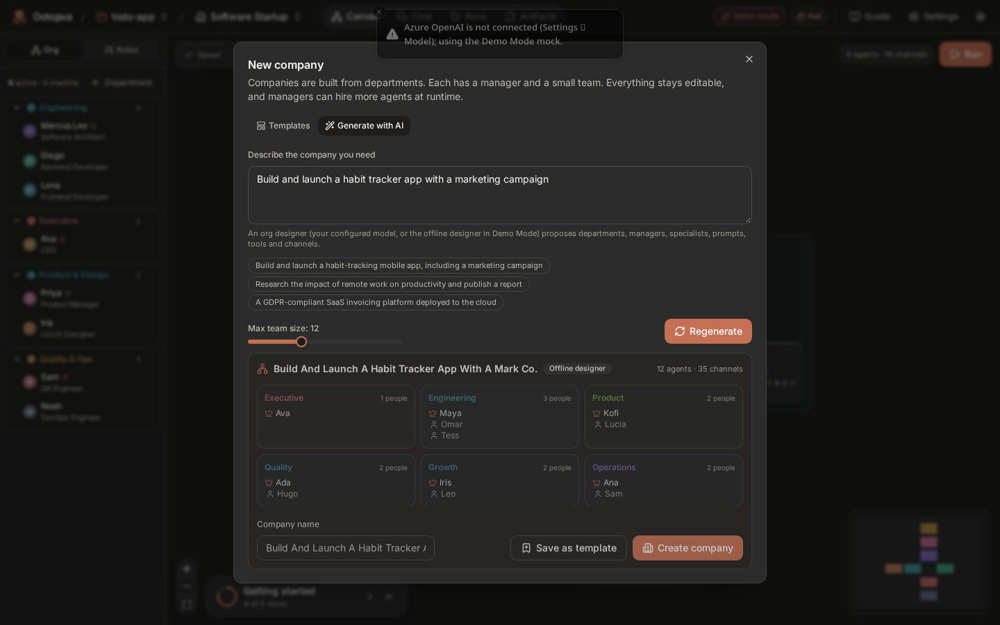 | 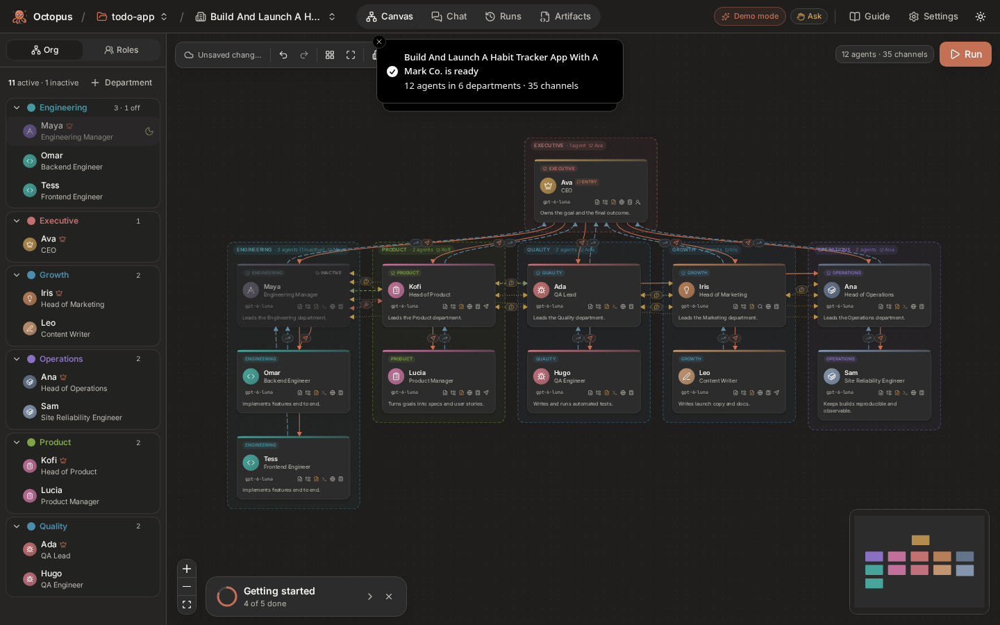 |
| 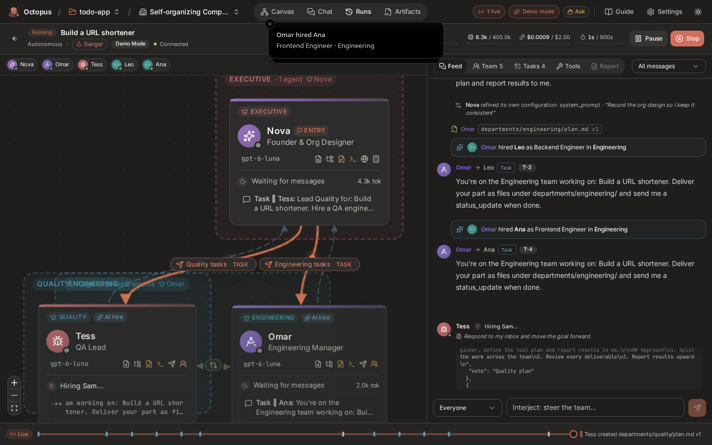 | 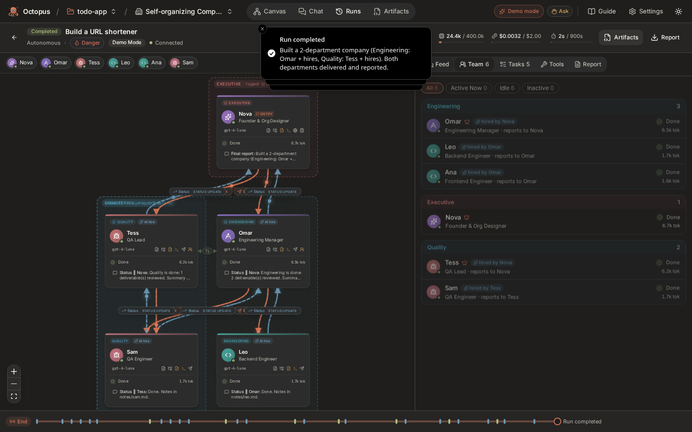 |

## Brand

The doodle octopus lives in [`docs/brand/`](docs/brand): `logo.svg` (full), `logo-mark.svg` (a simplified mark for favicons and small sizes) and light/dark banners. The palette uses warm neutrals (`#FAF9F5` / `#1F1E1D`), a terracotta accent (`#D97756`), olive (`#6B8440`) and steel blue (`#66839A`).

## Security

- **File access.** Agents only see the project folder. Absolute paths, `..` and symlinks that escape the folder are rejected on real paths. `.octopus/` and `.git/` are off-limits, and secrets (`.env`, keys) are blocked outside danger mode.
- **Commands.** They run without a shell, with a scrubbed environment and rlimits (CPU, memory, file size, processes) plus a timeout, and without network (`unshare -n`) where available. An allowlist applies outside danger mode; `SANDBOX_MODE=docker` isolates commands in containers.
- **Folder dialog.** It only opens for browsers on the same machine. The backend registers the chosen folder itself, so the browser never sends a path.
- **Preview.** Project previews run in a CSP sandbox with an opaque origin and no access to the Octopus API.
- **Browser.** The agents' browser uses an isolated, in-memory profile, so none of your cookies or logins.
- **MCP.** stdio MCP servers run commands **you** configure (`MCP_ALLOW_STDIO=false` disables them).
- **API.** It binds to `127.0.0.1`, with rate limiting, strict CORS and Pydantic validation. Single-user mode is on by default; set `SINGLE_USER_MODE=false` for JWT login.
